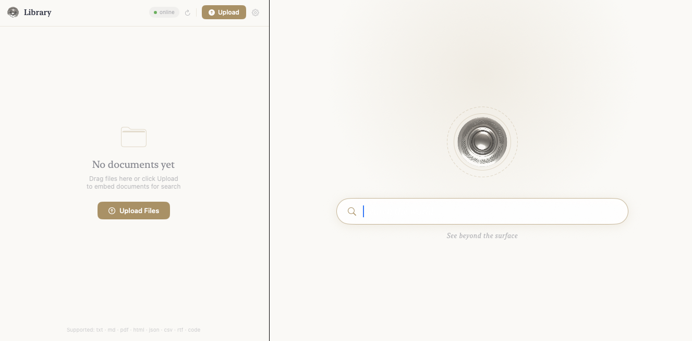

# Thread

<p align="center">
  <a href="Demo/README.md">
    
  </a>
</p>

Thread is a distributed vector search node for [Sewn](https://github.com/rao-studios/Seer). In standalone mode it exposes HTTP routes for direct use. In distributed mode it connects to a Sewn mothership over gRPC, registers itself, and serves all search and index traffic through a persistent bidirectional session stream.

## Sewn

[Sewn](https://github.com/rao-studios/Seer) is the mothership server that coordinates a fleet of Thread nodes. It handles authentication (via Supabase), conversation and RAG pipelines, sentiment analysis (Sinatra), royalty tracking (Gita), and personalization (Marielle). When a user issues a search or index request through Sewn, Sewn fans the operation out to all registered Thread nodes in parallel and merges the results.

Thread owns no user sessions and no authentication — that is Sewn's responsibility. Thread's sole job is fast, reliable vector storage and nearest-neighbor search.

## Prerequisites

### macOS (Apple Silicon)

- Xcode 16 / Swift 6.3+
- macOS 15+
- A [Mistral API key](https://console.mistral.ai/) (for Mistral embeddings) **or** Apple Silicon (for on-device MLX)

### Linux (Ubuntu 24.04 + NVIDIA GPU)

- Ubuntu 24.04 LTS (Noble)
- NVIDIA GPU — RTX 3080 / 3090 / 4080 / 4090 / A100 / H100
- Internet access for the one-time setup

---

## Setup

### macOS

```bash
# Mistral embeddings (requires API key)
cp .env.example .env
# Edit .env and set MISTRAL_API_KEY

# On-device MLX (no key needed — downloads ~500 MB model once)
pip3 install huggingface_hub
python3 -m huggingface_hub download mlx-community/Qwen3-Embedding-0.6B-4bit-DWQ
```

Build and run:

```bash
swift build -c release
.build/release/thread --host 127.0.0.1 --port 8080 --use-mlx
```

### Linux / Ubuntu 24.04 (NVIDIA GPU)

**One-time machine setup** — installs Swift 6.3.2, CUDA 12.9, LAPACK, and the cuDNN Frontend headers:

```bash
chmod +x setup-cuda-ubuntu.sh
./setup-cuda-ubuntu.sh
```

After the script finishes, open a new terminal (or `source ~/.bashrc`) so the CUDA and Swift paths are live.

**Download the embedding model** (one-time, ~500 MB):

```bash
python3 -m huggingface_hub download mlx-community/Qwen3-Embedding-0.6B-4bit-DWQ
```

**Build:**

```bash
chmod +x build-linux-cuda.sh
./build-linux-cuda.sh           # debug CUDA build (default)
./build-linux-cuda.sh --debug   # explicit debug
```

> `CUDA_ARCH` defaults to `sm_86` (RTX 30xx / A100). Override for other GPUs:
> ```bash
> CUDA_ARCH=sm_89 ./build-linux-cuda.sh   # RTX 40xx
> CUDA_ARCH=sm_90 ./build-linux-cuda.sh   # H100
> ```

**Run:**

```bash
.build/debug/thread --host 127.0.0.1 --port 8080 --use-mlx
```

The package is pinned to `riteshpakala/mlx-swift:gab/cuda1` which carries patches for CUDA 12.9 + GCC 13 half-precision math, CUTLASS-free sm_86 builds, SDPA cache sizing, and a GPU-only affine quantized matmul fallback. See [Docs/MLX-CUDA-Linux.md](Docs/MLX-CUDA-Linux.md) for the full patch log, fork commit hashes, and troubleshooting reference.

## Build & Run

**macOS**

```bash
swift build -c release

# Standalone — HTTP only, no Sewn required
.build/release/thread --host 127.0.0.1 --port 8080

# On-device MLX (Apple Silicon)
.build/release/thread --host 127.0.0.1 --port 8080 --use-mlx

# Distributed — registers with a running Sewn instance
.build/release/thread \
  --host 127.0.0.1 --port 8080 \
  --grpc-port 9090 \
  --mothership-host 127.0.0.1 \
  --mothership-grpc-port 50051
```

**Linux / Ubuntu 24.04**

```bash
./build-linux-cuda.sh

# Standalone with on-device GPU embeddings
.build/debug/thread --host 127.0.0.1 --port 8080 --use-mlx

# Distributed
.build/debug/thread \
  --host 127.0.0.1 --port 8080 \
  --grpc-port 9090 \
  --mothership-host 127.0.0.1 \
  --mothership-grpc-port 50051 \
  --use-mlx
```

Check health:

```bash
curl http://127.0.0.1:8080/health
# {"status":"ok"}
```

### CLI flags

| Flag | Default | Description |
|---|---|---|
| `--host` | `127.0.0.1` | HTTP bind address |
| `--port` | `8080` | HTTP port |
| `--grpc-port` | `9090` | gRPC listen port (distributed mode) |
| `--data-dir` | `~/Documents/thread-db` | Directory for on-disk state (env `THREAD_DATA_DIR`) |
| `--mothership-host` | _(none)_ | Sewn host — omit for standalone mode |
| `--mothership-grpc-port` | _(none)_ | Sewn gRPC port |
| `--use-mlx` | `false` | Use on-device MLX embeddings |
| `--mlx-model` | `Qwen3-Embedding-0.6B-4bit-DWQ` | Hub model ID for MLX |
| `--graph-model` | `Qwen3-1.7B-4bit` | Hub model ID for on-device graph extraction |
| `--no-graph-extraction` | `false` | Disable LLM extraction (keyword entities only) |

---

## Architecture

```
┌───────────────────────────────────────────────────────┐
│  Sewn (Mothership)                                    │
│  ┌──────────────┐  Fan-out: Search / Index /          │
│  │ ThreadQuery   │  Remove / Library / Graph ──────────┼──┐
│  │ Client       │                                     │  │
│  └──────┬───────┘                                     │  │
│         │  gRPC bidirectional Session stream          │  │
└─────────┼─────────────────────────────────────────────┘  │
          │  (Thread holds the connection)                  │
          ▼                                                │
┌───────────────────────────────────────────────────────┐  │
│  Thread (this repo)                                    │  │
│  MothershipRegistrationClient                         │  │
│    1. register()         — sends host/grpc/httpPort   │  │
│    2. session()          — bidirectional stream       │  │
│       • pings Sewn every 30 s                         │  │
│       • receives requests, dispatches via             │  │
│         MothershipRequestDispatcher                   │  │
│    3. updateAvailability() — signals storage capacity │  │
│                                                       │  │
│  gRPC Services (also reachable directly):             │◀─┘
│    ThreadQuery   — search / index / remove             │
│    ThreadLibrary — library (paginated groups)          │
│    ThreadGraph   — knowledge-graph queries             │
│                                                       │
│  Database (actor)                                     │
│    RegistryMutator  ─▶ ThreadRegistry                  │
│    TableMutator     ─▶ PartitionTable + GraphStore    │
│      PartitionIndex × M (per-document PQ)             │
│        PartitionQuantizer (PQ codebooks, ADC)         │
│      GraphStore (entities + relationships)            │
└───────────────────────────────────────────────────────┘
```

### Registration & session lifecycle

When `--mothership-host` is provided, `MothershipRegistrationClient` starts a persistent loop:

1. **`register` RPC** — Thread sends its UUID, HTTP host, gRPC port, and HTTP port. Sewn records the node and returns an acceptance signal. Thread retries every 5 s until accepted.
2. **`session` RPC** — Thread opens a bidirectional stream and holds it. Thread sends periodic pings every 30 s. Sewn sends request payloads (search, index, remove, library, graph, update, stats) over the same stream. `MothershipRequestDispatcher` routes each message to the correct service impl and writes the response back with a matching `correlationID`.
3. **`updateAvailability` RPC** — A one-shot call Thread makes when its storage capacity changes (e.g. after a large batch completes). Sewn uses this to steer new index requests to nodes that are accepting storage.

If the session drops, `MothershipRegistrationClient` sleeps 5 s and reconnects automatically.

---

## gRPC Services

All services run on `--grpc-port` (default 9090) and are also reachable via the Sewn session stream.

### ThreadQuery

| RPC | Request | Response | Description |
|---|---|---|---|
| `Search` | `ThreadSearchRequest` | `ThreadSearchResponse` | Hybrid KG + PQ search. Accepts raw `query_text` (Thread embeds it) or a precomputed `query_embedding`; optional `entities` gate the graph pre-filter. The response carries a `trace` describing entity matches and graph expansion. |
| `Index` | `ThreadIndexRequest` | `ThreadIndexResponse` | Embed and index a batch of documents. Returns immediately; async write queue drains in the background. |
| `Remove` | `ThreadRemoveRequest` | `ThreadRemoveResponse` | Remove specific document IDs, or all documents for an owner when `document_ids` is empty. |

### ThreadLibrary

| RPC | Request | Response | Description |
|---|---|---|---|
| `Library` | `ThreadLibraryRequest` | `ThreadLibraryResponse` | Paginated list of groups for an owner. `after_id` is a cursor; `limit` controls page size. |

### ThreadGraph

| RPC | Request | Response | Description |
|---|---|---|---|
| `Query` | `ThreadGraphQueryRequest` | `ThreadGraphQueryResponse` | Resolve seed entities by name and/or free-text similarity (Thread embeds `query`), traverse up to `hops` edges (0–3), and return entities, relationships, linked documents, and graph stats. |

### Session message envelope

Every payload traveling over the `Session` stream is wrapped in `ThreadSessionMessage`:

```protobuf
message ThreadSessionMessage {
  string correlation_id = 1;   // ties each request to its response
  string thread_id       = 2;   // set by Thread so Sewn can identify the stream

  oneof payload {
    ThreadSessionPing            ping                     = 3;
    ThreadSessionPong            pong                     = 4;
    ThreadSearchRequest          search_request           = 5;
    ThreadSearchResponse         search_response          = 6;
    ThreadIndexRequest           index_request            = 7;
    ThreadIndexResponse          index_response           = 8;
    ThreadRemoveRequest          remove_request           = 9;
    ThreadRemoveResponse         remove_response          = 10;
    ThreadLibraryRequest         library_request          = 11;
    ThreadLibraryResponse        library_response         = 12;
    // 13–22 reserved (retired ThreadHNSW arms)
    ThreadUpdateGroupRequest     update_group_request     = 23;
    ThreadUpdateGroupResponse    update_group_response    = 24;
    ThreadUpdateDocumentRequest  update_document_request  = 25;
    ThreadUpdateDocumentResponse update_document_response = 26;
    ThreadStatsRequest           stats_request            = 27;
    ThreadStatsResponse          stats_response           = 28;
    ThreadGraphQueryRequest      graph_request            = 29;
    ThreadGraphQueryResponse     graph_response           = 30;
  }
}
```

`MothershipRequestDispatcher` reads the `payload` oneof, calls the matching service impl, and returns a response message with the same `correlation_id`.

---

## Core Services

### Registry

The `ThreadRegistry` is the ownership and access-control layer. Every document must be registered to an owner before it can be searched.

| Concept | What it is |
|---|---|
| `ownerId` | Arbitrary string identifying the caller — passed in the request body (no auth middleware) |
| `DocumentID` | SHA-256 hash of the document's text chunks — content-addressed, collision-safe |
| `GroupID` | Owner-defined namespace that bundles documents together |
| `Access` | `.available` (globally searchable) or `.restricted` (owner-only, default) |

Documents are **deduplicated by content**: if two owners embed the same text, only one copy of the vectors is stored. The second owner is linked to the existing document automatically.

### Groups

Groups are logical collections owned by a single owner. Documents inside a group share metadata (tags, description) that surfaces in search. Access on the group propagates to all documents inside it.

```json
"group": {
  "id": "my-group",
  "label": "My Knowledge Base",
  "owner_id": "alice",
  "documents": [],
  "access": "restricted",
  "metadata": {
    "description": "Internal docs",
    "tags": ["swift", "server"]
  }
}
```

### Partition Table & Knowledge Graph

Each document is split into text chunks (partitions). Each partition gets a 1024-dimensional embedding. State lives in:

- **PartitionIndex** — per-document index holding PQ-compressed vectors, an entity embedding, learned codebooks, entity linkage, and an optional metadata blob.
- **PartitionTable** — flat map of document indices; search is a parallel per-document ADC scan with an entity pre-filter.
- **GraphStore** — the knowledge graph: content-addressed entities (`(kind, normalized name)` merges the same concept across documents), weighted relationships, and document-provenance sets that link the graph back to the vector store.

At search time, query entities are matched against the graph (name tokens + embedding cosine), the entity pre-filter narrows candidates, the ADC scan ranks partitions, and a one-hop graph expansion pulls in documents linked to neighboring entities (scored with a small penalty so direct hits win ties).

Entities and relationships arrive with the request, or are extracted on-device by a small LLM (`--graph-model`, default Qwen3-1.7B-4bit) in a detached post-response pass — keyword entities serve as the always-available fallback.

### Product Quantization (PQ)

Embeddings are compressed at index time via `PartitionQuantizer`. Each 1024-float vector is encoded into a compact `UInt16` code sequence using learned k-means codebooks. Search uses Asymmetric Distance Computation (ADC) against pre-computed distance tables — fast enough to scan millions of partitions without loading full vectors.

Codebook size scales dynamically with the training corpus (`scaledCodebookSize`): a document with 3 partitions uses k=2; a large shared index may grow to k=2048 or higher. An `adaptiveThreshold` is calibrated per-document from reconstruction errors during training and overrides the static per-codec fallback at search time.

If all partitions in a batch fail embedding (e.g. empty text), Thread skips index creation for that document and logs a warning rather than crashing.

### Persistence

All state persists as binary plist snapshots (`table-<nodeId>`, `graph-<nodeId>`, `registry`, `documents/*`) with a 1-second debounced save on the hot path and immediate saves for removes and shutdown.

On startup, two reconciliation sweeps close the debounce crash window: orphaned table documents are removed (and detached from the graph), and registry documents missing a table index are dropped so re-ingest is not blocked by the dedup check. Legacy shard/WAL artifacts from the previous HNSW format are purged automatically.

### EmbeddingModelProvider

Two backends, selected at startup with `--use-mlx`:

| Backend | Flag | Model | Dimensions |
|---|---|---|---|
| Mistral API (default) | _(none)_ | `mistral-embed` | 1024 |
| On-device MLX | `--use-mlx` | `Qwen3-Embedding-0.6B-4bit-DWQ` (default) | 1024 |

**Mistral** — Actor-based API client. Max 3 concurrent slots with a priority queue; identical texts within a batch are coalesced into one request. Requires `MISTRAL_API_KEY`.

**MLX** — Runs entirely on-device via Apple Silicon GPU. Model is loaded from the Hugging Face Hub cache on first request. No API key or network access needed after download. Use `--mlx-model` to specify a different Hub model ID.

---

## HTTP Routes

The HTTP routes are the **standalone path**. In distributed mode all production traffic flows through the gRPC session stream; the HTTP routes remain available for direct use and debugging.

### `POST /v1/batch/embeddings`

Indexes one or more documents. Each document's text is embedded and PQ-compressed, and its entities/relationships are merged into the knowledge graph (LLM extraction runs when the caller supplies none). The response is returned immediately — enrichment + indexing happen in a detached background task.

**Request**

```json
{
  "inputs": [
    "A string, or...",
    ["array", "of", "strings"]
  ],
  "sanitize": true,
  "sewn": {
    "owner_id": "alice",
    "group": {
      "id": "my-group",
      "label": "My Knowledge Base",
      "owner_id": "alice",
      "documents": []
    }
  },
  "tags": [
    ["optional", "per-document", "tags"],
    ["second-doc-tags"]
  ],
  "media_type": "text"
}
```

| Field | Type | Required | Description |
|---|---|---|---|
| `inputs` | `[String \| [String]]` | Yes | One entry per document. String or array of strings. |
| `sewn.owner_id` | String | Yes | Identity of the caller. Lowercased on receipt. |
| `sewn.group` | Group | No | Assigns all documents in this batch to a named group. |
| `sanitize` | Bool | No | When `true`, passes each input through `TextChunker` before embedding. Default: `false`. |
| `tags` | `[[String]]` | No | Per-document tag hints. Outer index aligns 1:1 with `inputs`. Auto-generated if empty. |
| `media_type` | String | No | `"text"` (default) or `"image"`. |

**Response**

```json
{
  "object": "list",
  "model": "mistral-embed",
  "usage": { "prompt_tokens": 312, "total_tokens": 312 },
  "success": true,
  "user": { ... }
}
```

---

### `POST /v1/search`

Searches indexed documents for the closest matching partitions to a query string.

**Request**

```json
{
  "query": "how does product quantization work?",
  "sewn": {
    "owner_id": "alice",
    "group": { "id": "my-group", "label": "...", "owner_id": "alice", "documents": [] },
    "scope": "personal",
    "aggregate": false
  }
}
```

| Field | Type | Required | Description |
|---|---|---|---|
| `query` | String | Yes | Natural language query. Embedded at search time. |
| `sewn.owner_id` | String | Yes | Scopes the search to this owner's documents by default. |
| `sewn.scope` | `"personal" \| "global"` | No | `personal` (default): only the owner's documents. `global`: all `.available` documents. |
| `sewn.aggregate` | Bool | No | When `true`, also searches groups the owner has access to. |
| `sewn.group` | Group | No | Restricts search to a specific group. |
| `sewn.groups` | [Group] | No | Restricts search to a list of groups. |
| `sewn.tags` | [String] | No | Tag filter: only documents whose tag embedding is within threshold are considered. |

**Response**

```json
{
  "object": "list",
  "texts": ["...most relevant partition text...", "...second result..."],
  "references": [
    { "document_id": "abc123", "partition_id": "def456", "distance": 0.12 }
  ]
}
```

`texts` and `references` are parallel arrays.

---

## Workflow Example

### 1 — Embed documents

```bash
curl -X POST http://127.0.0.1:8080/v1/batch/embeddings \
  -H "Content-Type: application/json" \
  -d '{
    "inputs": [
      "Swift actors serialize concurrent access by routing all calls through a single executor.",
      "Product quantization compresses high-dimensional vectors into compact integer codes."
    ],
    "sewn": {
      "owner_id": "alice",
      "group": {
        "id": "swift-docs",
        "label": "Swift Documentation",
        "owner_id": "alice",
        "documents": []
      }
    }
  }'
```

### 2 — Search

```bash
curl -X POST http://127.0.0.1:8080/v1/search \
  -H "Content-Type: application/json" \
  -d '{
    "query": "how do actors work in Swift?",
    "sewn": {
      "owner_id": "alice",
      "scope": "personal"
    }
  }'
```

### 3 — Share documents publicly (optional)

Documents are `.restricted` by default. To make a document globally searchable, set the group's `"access": "available"`:

```json
"group": {
  "id": "public-docs",
  "label": "Public Documentation",
  "owner_id": "alice",
  "documents": [],
  "access": "available"
}
```

Another owner can then find it with `"scope": "global"`.

---

## Notes

- **No authentication.** `owner_id` is taken directly from the request body. Use a reverse proxy (nginx, Caddy) with bearer token enforcement if you expose this to the internet.
- **Persistence.** The table, graph, and registry are persisted as plist snapshots under the data directory. Do not delete these while the server is running.
- **Deduplication.** Document IDs are SHA-256 hashes of their content. Submitting the same text twice under a different owner links the second owner to the existing vectors — no re-embedding occurs.
- **Tag auto-generation.** If no `tags` are supplied, `TagGenerator` derives frequency-weighted keywords from the text. These are embedded separately and used as a pre-filter during search.
- **Distributed mode.** In distributed mode all fan-out goes through the gRPC session stream. The HTTP routes remain available for direct use and debugging. Multiple Thread nodes can run simultaneously; Sewn fans search queries to all active nodes in parallel and merges results.

---

## Skills

Detailed internals and operational docs live in [`Skills/`](Skills/SKILLS.md):

| Skill | Contents |
|---|---|
| [Database](Skills/Database/README.md) | PartitionTable, GraphStore, PQ, Registry, search and index flows |
| [GRPC](Skills/GRPC/README.md) | Service impls, session stream, mothership registration, dispatcher |
| [Providers](Skills/Providers/README.md) | Mistral API provider, on-device MLX provider |
| [Concurrency](Skills/Concurrency/README.md) | Database actor, RegistryMutator, TableMutator, caching primitives |
| [Persistence](Skills/Persistence/README.md) | Plist snapshots, debounced saves, startup reconciliation |
| [API](Skills/API/README.md) | HTTP routes in standalone mode, request/response shapes |

## Docs

Setup and operational guides:

| Guide | Contents |
|---|---|
| [MLX on Linux / CUDA](Docs/MLX-CUDA-Linux.md) | Full CUDA build setup on Ubuntu 24.04 — dependencies, fork patches, CUDA arch selection, troubleshooting |
